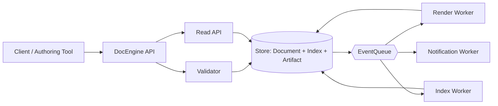

# Agent Docs Architecture (Recreated Draft)

## Overview

`agent-docs` is designed as a documentation processing and retrieval system with an event-driven pipeline. It centers on a **DocEngine** that coordinates ingestion, indexing, rendering, and publication while persisting state in a **Store** and propagating changes through an **EventQueue**.

Primary goals:
- predictable document lifecycle
- incremental updates with replayability
- clear separation of orchestration, storage, and delivery

## Core Components

### 1) DocEngine

DocEngine is the application core and workflow orchestrator.

Responsibilities:
- ingest source documents (markdown, metadata, assets)
- validate schema/frontmatter
- normalize content into internal document model
- trigger index/build tasks
- coordinate cache invalidation and publication hooks

Suggested internal modules:
- `Ingestor`: parse + normalize
- `Validator`: schema/rule checks
- `Planner`: computes affected docs for incremental rebuild
- `Renderer`: transforms internal model to target output(s)
- `Publisher`: emits versioned artifacts

### 2) Store

Store is the system-of-record for docs and build artifacts.

Responsibilities:
- maintain document versions/revisions
- keep metadata index (tags, slugs, owners, status)
- persist rendered artifacts + checksums
- support efficient lookup for changed dependencies

Logical storage layers:
- **Document Store**: canonical content + metadata
- **Index Store**: searchable projection for retrieval/navigation
- **Artifact Store**: rendered outputs and snapshots

Design expectation:
- append-friendly write pattern
- immutable revision IDs with mutable head pointers

### 3) EventQueue

EventQueue decouples writes from downstream processing.

Responsibilities:
- broadcast domain events (`DocCreated`, `DocUpdated`, `BuildRequested`, `BuildCompleted`)
- ensure ordered consumption per document key
- enable retries, dead-letter handling, and replay
- fan-out to indexing/search/notification workers

Processing model:
- at-least-once delivery
- idempotent consumers required
- observability on lag, retries, and poison messages

## Data/Control Flow

1. DocEngine receives create/update request.
2. Validator approves or rejects payload.
3. Store writes new revision and updates projections.
4. EventQueue emits domain events.
5. Async workers consume events and run render/index tasks.
6. Store persists artifacts and build status.
7. DocEngine exposes latest published head for clients.

## Mermaid Diagram

## Trade-offs

### Event-driven decoupling vs complexity
- **Pros**: scalable async processing, fault isolation, replay capability
- **Cons**: eventual consistency, harder debugging across services

### Immutable revisions vs storage cost
- **Pros**: auditability, deterministic rollback, reproducible builds
- **Cons**: higher storage footprint without compaction policies

### Incremental planning vs implementation burden
- **Pros**: faster rebuilds, lower compute cost at scale
- **Cons**: dependency graph maintenance complexity

### At-least-once semantics vs duplicate handling
- **Pros**: durability and resilience under failure
- **Cons**: consumer idempotency becomes mandatory

## Next Steps

1. Define event schema contract (JSON schema + versioning strategy).
2. Implement idempotency keys across render/index workers.
3. Add migration-safe Store abstraction and repository interface.
4. Introduce observability baseline:
   - queue lag
   - build latency percentile
   - failed event rate
5. Add architecture decision records (ADRs) for:
   - storage engine choice
   - queue backend
   - consistency model at read API
6. Draft failure-mode playbook (retry policy, DLQ replay, rollback).

## Notes

This document is a reconstructed draft based on prior ORCH-033 thinker output memory, intended as a baseline for refinement rather than a final, frozen architecture spec.
