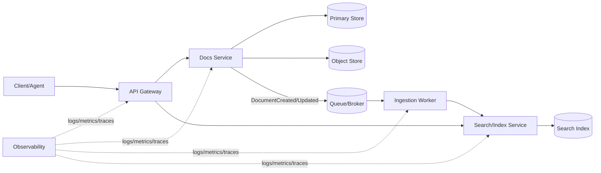

# Agent-Docs Architecture v0.1

## 1) Purpose
Agent-Docs는 에이전트 기반 워크플로우에서 생성되는 문서/요구사항/결정사항을 일관되게 저장, 검색, 추적하기 위한 경량 문서 플랫폼이다.

핵심 목표:
- 문서 생성/수정 이력의 신뢰성 확보
- 비동기 작업(큐) 기반 확장성
- 검색 가능한 구조화 메타데이터 유지

---

## 2) Component View

### Core Components
1. **API Gateway**
   - 인증/인가
   - 요청 라우팅
   - 속도 제한 및 감사 로깅

2. **Docs Service**
   - 문서 CRUD
   - 버전 관리(Revision)
   - 문서 상태 전이(DRAFT/REVIEW/PUBLISHED/ARCHIVED)

3. **Ingestion Worker**
   - 큐에서 문서 처리 이벤트 소비
   - 텍스트 정규화, 메타데이터 추출, 인덱싱 트리거

4. **Search/Index Service**
   - 전문 검색(Full-text)
   - 태그/속성 기반 필터

5. **Store Layer**
   - Primary Store: 문서/버전/메타데이터 저장
   - Object Store: 첨부 파일 및 대용량 본문 저장

6. **Queue/Broker**
   - 비동기 이벤트 전달
   - 재시도/데드레터 큐(DLQ)

7. **Observability**
   - 메트릭, 로그, 트레이싱
   - SLA/SLO 모니터링

---

## 3) High-Level Data Flow
1. 클라이언트가 API Gateway로 문서 생성 요청
2. Docs Service가 Primary Store에 문서+초기 리비전 저장
3. `DocumentCreated` 이벤트를 Queue에 발행
4. Ingestion Worker가 이벤트 소비 후 정규화/추출 수행
5. Search Service가 인덱스 업데이트
6. 클라이언트 검색 시 Search Service 통해 결과 반환

---

## 4) Mermaid Diagram



---

## 5) Trade-offs

### A. Strong Consistency vs Eventual Consistency
- 선택: 문서 원본 저장은 강한 일관성, 검색 인덱스는 이벤트 기반 최종 일관성
- 장점: 쓰기 성능과 확장성 확보
- 단점: 짧은 시간 검색 지연 가능

### B. Monolith vs Microservices
- 선택: 초기에는 모듈화된 단일 서비스(모놀리식) + 큐 기반 워커 분리
- 장점: 운영 복잡도 감소, 빠른 초기 개발
- 단점: 트래픽 증가 시 서비스 경계 재조정 필요

### C. RDBMS vs Document DB
- 선택: 메타데이터/관계성은 RDBMS, 대용량 본문/첨부는 Object Store
- 장점: 쿼리 유연성 + 저장 비용 효율
- 단점: 트랜잭션 경계가 스토어 간 분리됨

---

## 6) Next Steps
1. 도메인 모델 확정 (Document, Revision, Tag, AuditEvent)
2. 이벤트 스키마 버저닝 정책 수립 (`DocumentCreated v1` 등)
3. 검색 인덱스 매핑/동기화 전략 수립
4. 권한 모델 설계 (Owner/Editor/Viewer)
5. 운영 기준 정의 (SLO, 재시도 정책, DLQ 처리 런북)

---

## 7) JSON Outline

```json
{
  "version": "0.1",
  "system": "agent-docs",
  "components": [
    "api_gateway",
    "docs_service",
    "ingestion_worker",
    "search_index_service",
    "primary_store",
    "object_store",
    "queue_broker",
    "observability"
  ],
  "data_flow": [
    "create_document",
    "persist_revision",
    "publish_event",
    "consume_and_enrich",
    "index_update",
    "search_query"
  ],
  "tradeoffs": {
    "consistency": "strong_for_source_eventual_for_index",
    "architecture": "modular_monolith_plus_worker",
    "storage": "rdbms_plus_object_store"
  },
  "next_steps": [
    "finalize_domain_model",
    "define_event_versioning",
    "design_index_mapping",
    "implement_authz_model",
    "set_operational_slo"
  ]
}
```

---

## 한국어 요약
이 아키텍처 초안은 **문서 원본의 신뢰성(강한 일관성)**과 **검색/처리의 확장성(큐 기반 비동기 처리)** 사이의 균형을 목표로 한다. 초기 단계에서는 모듈형 모놀리식 + 워커 분리를 통해 개발/운영 복잡도를 낮추고, 트래픽 증가 시 서비스 분리를 점진적으로 적용한다.
